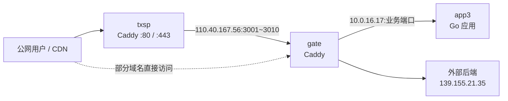

# 线上服务反向代理拓扑（app3 / gate / txsp）

> 采集时间：2026-09-06。本文基于三台服务器当前的监听端口、进程和 Caddyfile；不包含 DNS 解析、云防火墙或 CDN 控制台配置，因此公网入口以实际 DNS/CDN 配置为准。

## 一句话总结

```text
公网用户 → txsp（HTTP 域名入口）→ gate（中转端口 3001～3016）→ app3（业务进程）
```

其中：

- **txsp** 是主要的公网 HTTP 入口和第一层 Caddy 反代。
- **gate** 是内网中转 / 汇聚反代层，同时也承载部分直接域名入口；其 `:3001`、`:3006`、`:3010` 已启用新版 WAF。
- **app3** 不运行 Caddy/Nginx，直接运行各个 Go 后端服务。
- 部分域名绕过 txsp，直接由 gate 的 `:443` 代理到 app3 或其他远程服务器。

## 节点角色

| 节点 | 内网 IP | 角色 | 关键组件 |
|---|---:|---|---|
| `txsp` | `10.3.4.17` | 公网域名入口、第一层反代 | Caddy v2.11.4、`fabriziosalmi/caddy-waf v0.4.14`、v2ray |
| `gate` | `10.0.12.17` | 中转反代、部分直接域名入口、WAF | Caddy v2.11.4、`fabriziosalmi/caddy-waf v0.4.14` |
| `app3` | `10.0.16.17` | 业务应用宿主机 | 多个 Go 服务；无 Caddy/Nginx |

## 总体流向



`txsp` 在多个站点中向 `110.40.167.56:<port>` 反代；该地址对应 gate 的对外可访问地址。gate 再向 app3 的私网地址 `10.0.16.17:<port>` 转发。

## txsp → gate → app3：主要公网域名链路

| 公网域名（txsp） | txsp 上游 | gate 上游 | app3 服务 / 端口 | WAF 路径 |
|---|---|---|---|---|
| `fuxipan.com` / `www.fuxipan.com` | `110.40.167.56:3010` | `10.0.16.17:6655` | `go-fuxipan` | gate 新 WAF |
| `lzpanx.com` / `www.lzpanx.com` / `panso.me` | `110.40.167.56:3006` | `10.0.16.17:4685` | `go-lzpan` | gate 新 WAF |
| `qkpanso.com` / `www.qkpanso.com` | `110.40.167.56:3007` | `10.0.16.17:4686` | `go-qkpanso` | 未启用 |
| `alipanx.com` / `www.alipanx.com` | `110.40.167.56:3003` | `10.0.16.17:4677` | 当前未监听 | 未启用 |
| `api.hunhepan.com` / `www.hunhepan.com` / `hunhepan.com` | `110.40.167.56:3001` | `10.0.16.17:3765` | `go-hunhepan` | txsp 新 WAF + gate 新 WAF |
| `reman.xwd.pw` | `110.40.167.56:3009` | `10.0.16.17:4678` | `go-reman` | txsp 新 WAF |
| `v2fd.com` | `110.40.167.56:3008` | `10.0.16.17:8484` | `go-v2fd` | txsp 新 WAF |

### 需要关注的异常链路

- gate 的 `:3003` 仍反代至 `10.0.16.17:4677`，但采集时 app3 未监听 `4677`；这会导致 `alipanx.com` 返回 `502`。
- gate 的 `:3002` 指向 `10.0.16.17:4680`，采集时 app3 也未监听该端口。

## gate 直接处理的域名

下列站点不经过 txsp 的端口中转，直接由 gate 的 Caddy `:443` 处理：

| gate 域名 | 上游 |
|---|---|
| `captcha.misiai.com` | `10.0.16.17:8899`（`go-slide`） |
| `hhpapi.lzpan.com` | `10.0.16.17:3765`（`go-hunhepan`） |
| `lz.lzpan.com` | `10.0.16.17:4685`（`go-lzpan`） |
| `qk.lzpan.com` | `10.0.16.17:4686`（`go-qkpanso`） |
| `ujs.lzpan.com` | `139.155.21.35:3006`（外部后端） |
| `yjs.lzpan.com` | `139.155.21.35:3007`（外部后端） |

这些 gate 直接域名当前没有导入 WAF 宏。

## gate 中转端口完整映射

| gate 端口 | 上游 | 备注 |
|---:|---|---|
| 3001 | `app3:3765` | hunhepan；新 WAF |
| 3002 | `app3:4680` | xlpanso；采集时上游未监听 |
| 3003 | `app3:4677` | alipanx；采集时上游未监听 |
| 3004 | `app3:2045` | `go-taokeapi` |
| 3005 | `app3:4859` | `go-kitboxpro` |
| 3006 | `app3:4685` | `go-lzpan`；新 WAF |
| 3007 | `app3:4686` | `go-qkpanso` |
| 3008 | `app3:8484` | `go-v2fd` |
| 3009 | `app3:4678` | `go-reman` |
| 3010 | `app3:6655` | `go-fuxipan`；新 WAF |
| 3011 | `139.155.21.35:3006` | 外部后端 |
| 3012 | `139.155.21.35:3007` | 外部后端 |
| 3013 | `app3:4441` | `go-revjs` |
| 3014 | `app3:8788` | `go-keyhub` |
| 3015 | `app3:8799` | `go-nav` |
| 3016 | `app3:5384` | `go-ai-api` |

## WAF 现状

### gate：新版 WAF

- 模块：`github.com/fabriziosalmi/caddy-waf v0.4.14`
- 生效端口：`:3001`、`:3006`、`:3010`
- 规则文件：
  - `/etc/caddy/waf/rules.json`（内置规则）
  - `/etc/caddy/waf/legacy-rules.json`（从旧 WAF 迁移的规则）
- 黑白名单：
  - `/etc/caddy/waf/ip_blacklist.txt`
  - `/etc/caddy/waf/ip_whitelist.txt`
- 日志：`/var/log/caddy/waf.json`

### txsp：新版 WAF

- 模块：`github.com/fabriziosalmi/caddy-waf v0.4.14`
- 原 `args_rule`、`post_rule`、`user_agent_rule` 规则已迁移为 `/etc/caddy/waf/legacy-rules.json`。
- 当前导入 WAF 的站点：hunhepan、reman、v2fd。
- 规则、黑白名单和日志目录与 gate 一致：`/etc/caddy/waf/`、`/var/log/caddy/waf.json`。

因此 `hunhepan` 请求会经过两次**新版** WAF：先 txsp，再到 gate。

## app3 业务服务

| 端口 | 进程 |
|---:|---|
| 2045 | `go-taokeapi` |
| 3765 | `go-hunhepan` |
| 4441 | `go-revjs` |
| 4678 | `go-reman` |
| 4685 | `go-lzpan` |
| 4686 | `go-qkpanso` |
| 4859 | `go-kitboxpro` |
| 5384 | `go-ai-api` |
| 6655 | `go-fuxipan` |
| 8484 | `go-v2fd` |
| 8788 | `go-keyhub` |
| 8799 | `go-nav` |
| 8899 | `go-slide` |

### 不经 gate 的 app3 监听端口

| 端口 | 进程 | 当前状态 / 建议 |
|---:|---|---|
| 4344 | `sshd` | SSH 管理端口；启用 UFW 时必须先放行。 |
| 8080 | `sing-box` | 已改为仅监听 `127.0.0.1`。 |
| 38080、38081 | `sing-box` | 已仅监听 `127.0.0.1`。 |
| 53 | `systemd-resolved` | 已仅监听回环地址。 |

## 运维与安全建议

1. **明确入口职责**：建议将 txsp 定义为唯一公网 HTTP 入口，gate 的 `3001～3016` 仅通过云安全组或主机防火墙允许 txsp 访问。
2. **app3 已收敛入站访问**：UFW 已启用，默认拒绝入站；仅允许 SSH `4344/tcp` 和 gate（`10.0.12.17`）访问任意 TCP 端口。该策略覆盖未来新增的 gate → app3 TCP 后端，无需逐端口维护。详见 [`app3-network-hardening.md`](app3-network-hardening.md)。
3. **统一 WAF 策略**：txsp 与 gate 均已使用新版 WAF。建议后续确定一个明确的 WAF 层，避免 hunhepan 的双重检测、其他站点却没有 WAF 的不一致状态。
4. **谨慎处理转发头**：当前多层代理会透传 `X-Forwarded-For`。若后续在新版 WAF 上启用基于真实客户端 IP 的限流、GeoIP 或 ASN 规则，应为可信上游显式配置 `trusted_proxies`，不要无条件信任客户端可伪造的头。
5. **修复失效上游**：检查 app3 的 `4680` 和 `4677` 服务状态，或暂时下线 gate 对应的 `:3002`、`:3003` 路由，避免持续 502。
6. **凭据不入库**：Caddyfile 可能含 DNS Provider API Token；本文未记录该类凭据。建议改由环境变量或受限权限的凭据文件注入，并定期轮换。
